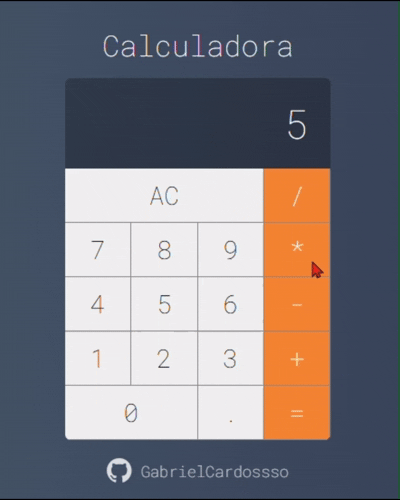

<div align="center">


<br>


<br><br>

💻 Projeto desenvolvido com foco em lógica de programação, componentização e manipulação de estados no React.

</div>

---

# ✨ Funcionalidades

✅ Operações matemáticas básicas
✅ Operações encadeadas
✅ Suporte ao teclado
✅ Atualização dinâmica do display
✅ Limpeza automática do display após resultado
✅ Interface moderna
✅ Responsivo
✅ Estrutura organizada em componentes

---

# 🧠 Como funciona

A calculadora possui um sistema de operações encadeadas semelhante a calculadoras reais.

### Exemplo:

```txt
10 + 10 + 5
```

O sistema:

* calcula automaticamente a operação anterior
* mantém o fluxo da conta
* atualiza o display em tempo real

Além disso:

* ao pressionar "=" o display mostra apenas o resultado
* ao iniciar uma nova operação o cálculo continua normalmente

---

# ⚙️ Tecnologias utilizadas

```txt
⚛️ React.js
🟨 JavaScript
🎨 CSS3
🌐 HTML5
```

---

# 🧩 Organização dos componentes

### 🔘 Button.jsx

Responsável pelos botões da calculadora.

### 📺 Display.jsx

Responsável pela exibição dos números e resultados.

### 🧠 Calculator.jsx

Contém toda a lógica principal da calculadora.

---

# 🚀 Como executar o projeto

## Clone o repositório

```bash
git clone LINK_DO_REPOSITORIO
```

## Entre na pasta do projeto

```bash
cd calculadora-react
```

## Instale as dependências

```bash
npm install
```

## Execute o projeto

```bash
npm start
```

---

# 📚 Conceitos praticados

* Componentização
* Props
* Estados
* Eventos
* Manipulação do DOM com React
* Organização de projeto
* Lógica de programação
* Operações matemáticas
* CSS modularizado

---

# 📸 Preview

<div align="center">



</div>

---

# 👨‍💻 Autor

<div align="center">

## Gabriel Cardoso Corrêa Marcos

🎯 Estudante de Desenvolvimento de Sistemas

</div>

---

<div align="center">

### ⭐ Se gostou do projeto, deixe uma estrela no repositório ⭐


</div>
